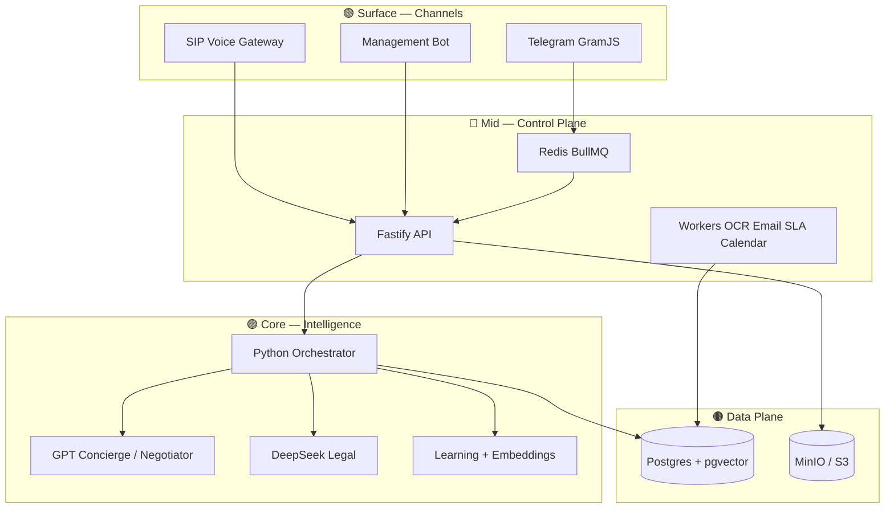

```
     ╔═══════════════════════════════════════════════════════════╗
     ║                                                           ║
     ║      █████╗ ██╗   ██╗████████╗ ██████╗                    ║
     ║     ██╔══██╗██║   ██║╚══██╔══╝██╔═══██╗                   ║
     ║     ███████║██║   ██║   ██║   ██║   ██║                   ║
     ║     ██╔══██║╚██╗ ██╔╝   ██║   ██║   ██║                   ║
     ║     ██║  ██║ ╚████╔╝    ██║   ╚██████╔╝                   ║
     ║     ╚═╝  ╚═╝  ╚═══╝     ╚═╝    ╚═════╝                    ║
     ║                                                           ║
     ║     ██╗      ██████╗  ██████╗ ██╗███████╗████████╗         ║
     ║     ██║     ██╔═══██╗██╔════╝ ██║██╔════╝╚══██╔══╝         ║
     ║     ██║     ██║   ██║██║  ███╗██║███████╗   ██║            ║
     ║     ██║     ██║   ██║██║   ██║██║╚════██║   ██║            ║
     ║     ███████╗╚██████╔╝╚██████╔╝██║███████║   ██║            ║
     ║     ╚══════╝ ╚═════╝  ╚═════╝ ╚═╝╚══════╝   ╚═╝            ║
     ║                                                           ║
     ║              ✦  A U T O L O G I S T I C S  O S  ✦         ║
     ╚═══════════════════════════════════════════════════════════╝
```

# 🚛✨ AutoLogistics OS

### China → Russia freight autopilot for **ООО «____________»**

> 🧊 **3D product layer** — Telegram + SIP voice on the surface, GPT orchestration in the mid-layer, DeepSeek customs + learning loop in the core.

An autonomous logistics operating system that talks like a live manager, sizes cargo, hunts carrier rates (API + email), computes duty/VAT, drafts contracts, escalates edge cases to humans, and **self-calibrates** from closed deals.

---

## 🧭 Navigation Hub

| 📘 Doc | 🎯 Purpose |
|--------|------------|
| [docs/INDEX.md](docs/INDEX.md) | 📚 Premium docs hub (start here) |
| [docs/ENV_SETUP.md](docs/ENV_SETUP.md) | Every `.env` key — where to register, how to fill |
| [docs/COMMANDS.md](docs/COMMANDS.md) | CLI, bot commands, HTTP API |
| [docs/ARCHITECTURE.md](docs/ARCHITECTURE.md) | System contours & message flow |
| [docs/PLAN_COMPLIANCE.md](docs/PLAN_COMPLIANCE.md) | ✅ 100% plan coverage map |
| [docs/RUNBOOK.md](docs/RUNBOOK.md) | Ops, secrets, anti-ban, incidents |
| [logs/README.md](logs/README.md) | Log tree & tail recipes |

---

## 🧊 What the product can do

| 🧩 Contour | 🚀 Capability |
|------------|---------------|
| 💬 **Client Telegram** | GramJS manager account — full chat cycle in DMs / groups |
| 📞 **Voice channel** | SIP (Zadarma / Beeline Biz) + OpenAI Realtime — answer, transcript, transfer |
| 🎛️ **Management Bot** | Pause, takeover, approve/reject, margins, playbooks, learning toggle |
| 📡 **Executive Channel** | Real-time alerts + daily CEO digest (09:30 MSK) |
| 🧠 **GPT orchestrator** | Dialogue, negotiation, deal plan, tool-calling |
| ⚖️ **DeepSeek Legal** | HS codes, compliance, contract drafts, risk matrix |
| 📬 **Rate Hunter** | CDEK / HTTP / JSON tariffs + SMTP quote requests |
| 📧 **Gmail / Yandex** | Outbound SMTP + inbound IMAP sync (`Ref: deal_id`) |
| 📈 **Learning Loop** | Dim calibration, partner score, canary playbooks, embeddings RAG |
| 🗓️ **Calendar** | Google Calendar sync + ICS export |

### 🔄 Deal lifecycle (depth layers)

```text
        ┌──────────┐
   L3 → │  closed  │  won / lost
        └────▲─────┘
        ┌────┴─────┐
   L2 → │ contract │ ← negotiation ← pricing ← quoting
        └────▲─────┘
        ┌────┴─────┐
   L1 → │  customs │ ← sizing ← intake
        └──────────┘
   Anywhere → awaiting_manager (escalation)
```

---

## 🏗️ Architecture (3D stack)



---

## 🧰 Tech stack

| Layer | Stack |
|-------|--------|
| **apps/tg-gateway** | TypeScript · GramJS · grammY · BullMQ |
| **apps/voice-gateway** | TypeScript · Fastify · OpenAI Realtime · SIP/RTP |
| **apps/api** | Fastify · pg · Zod · MinIO SigV4 |
| **apps/workers-ts** | BullMQ · Nodemailer · IMAP · OCR · Calendar |
| **services/** | Python 3.11+ · FastAPI · OpenAI SDK · psycopg |
| **packages/shared** | Shared types · queues · company profile |
| **infra** | Docker Compose · Postgres+pgvector · Redis · MinIO · Langfuse |

---

## ✅ Requirements

- Node.js **≥ 20**, pnpm **9+** (corepack)
- Python **≥ 3.11**
- Docker Desktop (Postgres / Redis / MinIO)
- Accounts as you leave dev mode: Telegram API + session, BotFather, OpenAI / DeepSeek, Gmail or Yandex

---

## ⚡ Quick start

### 🪟 Windows (recommended)

```powershell
.\scripts\setup.ps1
.\scripts\start.ps1
.\scripts\start.ps1 -WithGateway
.\scripts\start.ps1 -WithVoiceGateway
.\scripts\docker-rebuild.ps1
.\scripts\stop.ps1 -DockerToo
```

npm aliases: `pnpm setup` · `pnpm start` · `pnpm docker:rebuild` · `pnpm stop`

### 🐧 Linux / macOS

```bash
chmod +x scripts/*.sh
./scripts/setup.sh
./scripts/start.sh
WITH_GATEWAY=1 ./scripts/start.sh
./scripts/docker-rebuild.sh
DOCKER_TOO=1 ./scripts/stop.sh
```

### 📜 What the scripts do

| Script | Action |
|--------|--------|
| `setup` | `.env`, pnpm, shared build, Python venv, Docker infra |
| `start` | Infra + uvicorn `:8000` + API + workers (+ gateways) |
| `docker-rebuild` | Force-recreate full app stack |
| `stop` | Kill background PIDs from `data/logs/*.pid` |

### 🛠️ Manual boot (step-by-step)

```bash
copy .env.example .env          # or cp on Unix
docker compose -f infra/docker-compose.yml up -d postgres redis minio
pnpm install
pnpm --filter @alo/shared build
pnpm dev:api                    # :3000
# services/.venv → uvicorn orchestrator.app:app --reload --port 8000
```

Telegram session:

```bash
pnpm --filter @alo/tg-gateway login
# paste TG_STRING_SESSION into .env
```

### 🧪 Dev mode

Without TG / LLM / SMTP keys the stack still boots:

- gateway replies land in logs
- concierge & legal use heuristics
- mock rates only when `ALLOW_MOCK_RATES=true` (default outside production)

### 🚀 Production checklist

1. `ALO_ENV=production` + `ALLOW_MOCK_RATES=false`
2. `PARTNER_QUOTE_EMAILS` and/or `PARTNER_CDEK_*` / `PARTNER_HTTP_*` / tariff JSON
3. SMTP/IMAP + `MAIL_REQUIRE_SMTP=true`
4. `GOOGLE_CALENDAR_ENABLED=true` + calendar OAuth scope
5. `INTERNAL_API_TOKEN` shared by API / workers / orchestrator
6. `python -m agents.hs_feed` (or `HS_FEED_URL`)
7. Optional: `docker compose --profile observability up` + `LANGFUSE_*`

---

## 💎 Featured capabilities

- 🔐 Gmail OAuth2 + **Google Calendar** sync + ICS `GET /calendar/export.ics`
- 🧾 OCR invoice → cargo fields → **auto re-quote**
- 📬 IMAP quote → **auto re-quote**
- 💱 FX lock via **CBR** (+ Frankfurter fallback)
- 📚 HS duty feed (`hs_duty_rates`) + legal corpus RAG
- 🚚 CDEK / HTTP / JSON tariff adapters (no demo partners in prod)
- 🧠 Playbooks drive margin/floor; embeddings on quote/close
- 🌙 Voice after-hours message mode
- 🔭 Langfuse traces + CI e2e smoke

---

## 📧 Mail: Gmail & Yandex

Two directions:

1. **SMTP out** — rate requests to carriers  
2. **IMAP in** — replies matched by `Ref: <deal_uuid>`

Set `MAIL_PROVIDER=gmail|yandex|custom`.

### Gmail

| | |
|--|--|
| SMTP | `smtp.gmail.com:587` STARTTLS |
| IMAP | `imap.gmail.com:993` SSL |

```env
MAIL_PROVIDER=gmail
MAIL_USER=your.company@gmail.com
MAIL_APP_PASSWORD=xxxx xxxx xxxx xxxx
MAIL_FROM=ZHD Transinvest <your.company@gmail.com>
MAIL_SYNC_ENABLED=true
```

Prefer OAuth2 for Workspace: `MAIL_AUTH_MODE=oauth2` + `MAIL_OAUTH_*`.

### Yandex

| | |
|--|--|
| SMTP | `smtp.yandex.ru:465` SSL |
| IMAP | `imap.yandex.ru:993` |

Enable IMAP + app password in Yandex ID security settings.

### Sync behavior

- Worker polls IMAP (`MAIL_IMAP_MAILBOX=INBOX`)
- `Ref:` binds message → deal
- Price/ETA parsed (heuristic + optional LLM)
- New quote → `quotes` table + Executive Channel ping + re-price

---

## 📞 Voice (SIP)

| Provider | Env |
|----------|-----|
| Zadarma | `SIP_PROVIDER=zadarma` |
| Beeline Biz | `SIP_PROVIDER=beeline` |

Full walkthrough: [ENV_SETUP §10](docs/ENV_SETUP.md#10-voice-sip-zadarma--beeline--voice-gateway).

---

## 🧪 Tests & CI

```bash
pnpm -r run typecheck
pnpm test:py
```

GitHub Actions: Node typecheck · pytest · compose e2e smoke.

---

## ⚠️ Guardrails

- Never promise a fixed price on an expired quote TTL  
- Never train on “successful grey” schemes — hard-blocked  
- Never mass-email unverified domains without whitelist/approve  
- Never run TG userbots without rate limits — session ban risk  

Customs / legal outputs are **preliminary**. Final HS & contracts need a human when risk thresholds fire.

---

## 📜 License & Support

**Proprietary — All Rights Reserved** — Copyright (c) 2026 Pankov Sergey Vladimirovich  

Use, copy, modify, or distribute **only with prior written permission** from the copyright holder.  
Full text: [LICENSE](LICENSE) · donations: [SUPPORT.md](SUPPORT.md)

**Technical gate:** API / gateways record first start, then after **180 days** refuse to boot without `LICENSE_KEY`.  
Issue keys: `node scripts/issue-license.mjs` · force immediate check: `LICENSE_ENFORCE=true`

| | |
|--|--|
| **USDT (ERC20)** | `0x587d0B8B786BC8254862dFDd632E00C81752B50a` |
| **BTC** | `1Hehwq6T9E6JhWu1u7e7PHAqxmQwQXWA9m` |

---

<p align="center">
  <b>🛸 AutoLogistics OS — surface chats · mid queues · deep intelligence</b><br/>
  <sub>Built for China→Russia white-lane freight · ООО «ЖД Трансинвест»</sub>
</p>
