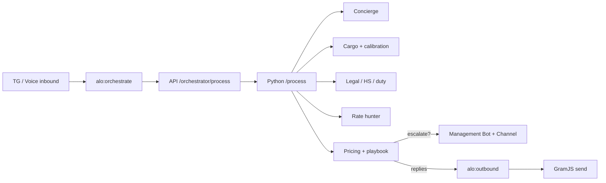

<pre>
╔══════════════════════════════════════════════════════════════╗
║  🧊 ARCHITECTURE · AutoLogistics OS · 3D CONTROL PLANE       ║
╚══════════════════════════════════════════════════════════════╝
</pre>

# 🏗️ Architecture — AutoLogistics OS

> Think of the system as three floating slabs: **channels** on top, **queues + API** in the middle, **agents + data** at the core.

---

## 🟢 Contours (surface)

| # | Contour | Implementation |
|---|---------|----------------|
| 1️⃣ | **Client chats** | GramJS user account — `apps/tg-gateway` |
| 2️⃣ | **Management Bot** | grammY bot — approve / policy / takeover |
| 3️⃣ | **Executive Channel** | Alerts + daily digest (same bot token) |
| 4️⃣ | **Voice** | SIP trunk + OpenAI Realtime — `apps/voice-gateway` |

---

## 🔵 Message flow (mid slab)



**ASCII depth view**

```text
        ..............................  CHANNELS
        #### Redis · Fastify API #####  CONTROL
        ##### Orchestrator · Agents ##  BRAIN
        #### Postgres · MinIO · Redis #  MEMORY
```

---

## 🟣 Models (core intelligence)

| Model | Role |
|-------|------|
| 🧠 **GPT** | Dialogue, negotiation, orchestration, OCR assist |
| ⚖️ **DeepSeek** | HS / customs / contracts JSON |
| 🔢 **Embeddings** | Deal RAG via pgvector (`text-embedding-3-small`) |

---

## 🟤 Data & learning

```text
Outcomes → learning_events
        → calibration_coeffs (weight/volume)
        → partner scores
        → playbook proposals (pending_approve → canary 10%)
        → embeddings (quote_generated / closed_*)
```

---

## 🛡️ Safety rails

- 🚫 Grey-scheme regex **hard block**
- 📉 Margin floor / amount threshold / `must_approve` → human
- 🔑 Idempotency keys on `/process`
- 🧯 DLQ table + BullMQ retries
- 🔐 `INTERNAL_API_TOKEN` on `/internal/*`

---

## 🔗 Related

- [ENV_SETUP.md](ENV_SETUP.md) · [COMMANDS.md](COMMANDS.md) · [RUNBOOK.md](RUNBOOK.md) · [PLAN_COMPLIANCE.md](PLAN_COMPLIANCE.md)
