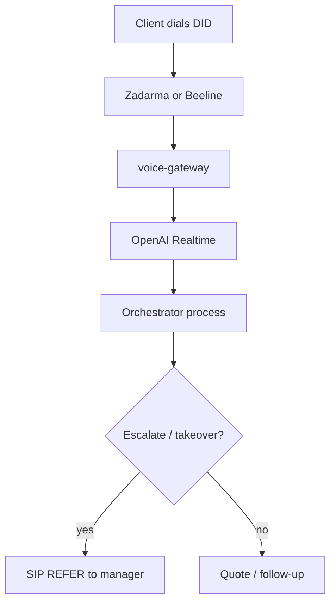

<pre>
╔══════════════════════════════════════════════════════════════╗
║  📞 VOICE DEEP-DIVE · SIP · REALTIME · 3D CALL PATH          ║
╚══════════════════════════════════════════════════════════════╝
</pre>

# 📞 Voice deep-dive — SIP + OpenAI Realtime

> Maintained companion to **[ENV_SETUP.md §10](ENV_SETUP.md#10-voice-sip-zadarma--beeline--voice-gateway)**.  
> All product docs are English; this file expands the call path in premium detail.

---

## 🧊 3D call path

```text
        ░░░░░░░░░░░░░░░░░░░░░░░░░  PSTN (client dials DID)
        ▓▓▓ Zadarma / Beeline ▓▓▓  SIP signaling + RTP audio
        ████ voice-gateway █████  :3010 HTTP · :5060 UDP · Realtime
        ▓▓▓ API / orchestrator ▓  same deal loop as Telegram
        ░░░░░ manager REFER ░░░░  VOICE_MANAGER_TRANSFER_NUMBER
```



**Voice is optional.** The rest of AutoLogistics OS runs without a trunk.

---

## ✅ Prerequisites

| Need | Why |
|------|-----|
| `OPENAI_API_KEY` | Realtime speech — no key, no talk |
| Zadarma **or** Beeline Biz + RU DID | PSTN identity |
| SIP login/password from portal | Trunk registration |
| Public IP (or stable port-forward) | Provider sends SIP/RTP to you |
| Open UDP `SIP_PORT` + RTP range | Otherwise “call rings, no audio” |

Laptop without a white IP usually **cannot** host production SIP. HTTP tunnels (ngrok) are **not** suitable for SIP/RTP.

---

## 🔀 Provider choice

| | Zadarma | Beeline Business |
|--|---------|------------------|
| Best when | Fast start, virtual DID, simple SIP | Existing corporate Cloud PBX |
| `SIP_PROVIDER` | `zadarma` | `beeline` / `beeline_business` |
| Default domain | `sip.zadarma.com` | `sip.beeline.ru` (confirm in portal) |
| Complexity | Easier | Proxy + `user@domain` auth |

```env
SIP_PROVIDER=zadarma
```

---

## 🚀 Zadarma quick path

1. Register → https://zadarma.com / https://my.zadarma.com  
2. Buy / attach a RU virtual number  
3. **Settings → SIP Connection** → copy login/password  
4. Route DID to that SIP account  
5. Fill `.env` (`SIP_USERNAME`, `SIP_PASSWORD`, `SIP_PUBLIC_HOST`, `VOICE_DID_NUMBER`)  
6. Open firewall UDP **5060** + RTP (e.g. **10000–10200**)  
7. `.\scripts\start.ps1 -WithVoiceGateway`  
8. `curl http://localhost:3010/health` → `"sip": { "active": true, ... }`  
9. Call the DID — agent should greet  

Docs: https://zadarma.com/en/support/faq/voip/

---

## 🏢 Beeline Business quick path

1. Open Cloud PBX / SIP telephony portal  
2. Map fields:

| Portal field | `.env` |
|--------------|--------|
| SIP User / login | `SIP_USERNAME` |
| Password | `SIP_PASSWORD` |
| Domain | `SIP_DOMAIN` |
| Outbound proxy | `SIP_OUTBOUND_PROXY` |
| Auth user (`user@domain`) | `SIP_AUTH_USERNAME` |

3. Set `SIP_PROVIDER=beeline`  
4. Same firewall + voice-gateway start as Zadarma  

---

## 🧩 Connection modes

| Mode | When |
|------|------|
| **REGISTER** | Classic login/password (default) |
| **SIP URI** (`SIP_URI_MODE=1`) | Provider sends INVITE to `sip:did@your-public-host:5060` on a white IP |

---

## 🌙 After-hours

```env
VOICE_AFTER_HOURS_MODE=message
VOICE_HOURS_START=9
VOICE_HOURS_END=19
VOICE_TZ=Europe/Moscow
```

Outside hours the agent speaks a short message and hangs up (~20s). Weekend = after-hours by default.

---

## 🧪 Verify

| Check | Expect |
|-------|--------|
| `GET :3010/health` | SIP active |
| Inbound call | Greeting + transcript |
| Management Bot `/call` | Live session |
| `/takeover` | SIP REFER to manager |

---

## 🔗 Related

- [ENV_SETUP.md](ENV_SETUP.md) · [RUNBOOK.md](RUNBOOK.md) · [COMMANDS.md](COMMANDS.md) · [INDEX.md](INDEX.md)

<p align="center">📞 Voice slab online · white IP · open UDP · Realtime key</p>
